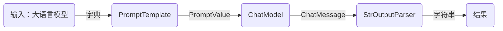
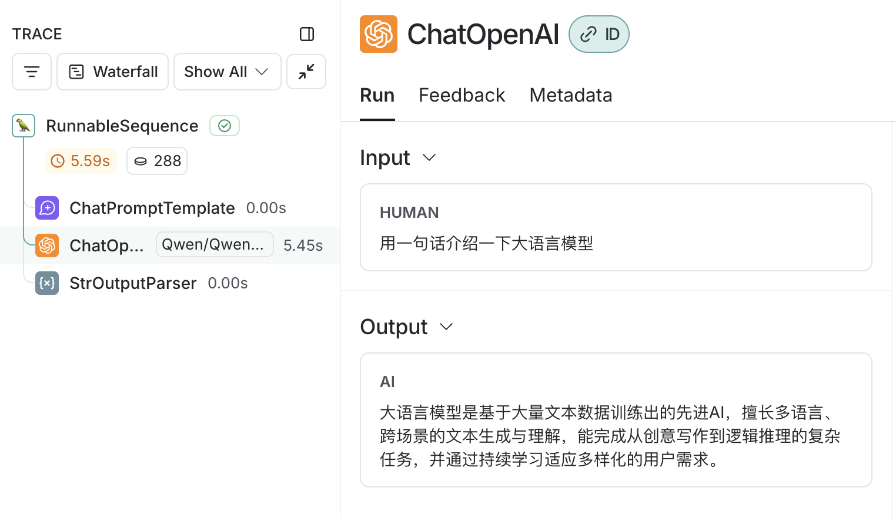

## 自定义 OutputParser
[custom_outputparse.ipynb](./custom_outputparse.ipynb)

## LCEL
[LCEL.ipynb](./LCEL.ipynb)

- LCEL
- LangSmith
- 提示词模板（ChatPromptTemplate）
- StrOutputParser

> LangSmith 追踪：

## Chat Translator（对话翻译助手）
[chat_translator.ipynb](./chat_translator.ipynb)

- 简单流式输出（stream）
- 提示词模板（ChatPromptTemplate）
- 消息类型（HumanMessage, SystemMessage）

