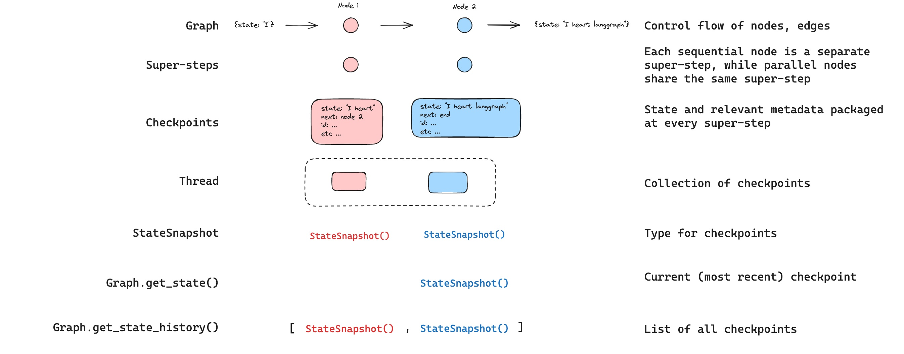

## LangGraph 基础 

1. [Command 基本用法](./command_basic_usage.py)  
    在同一个节点中既执行状态更新，又决定接下来要前往哪个节点

2. [Command 进阶用法](./command_extend_usage.py)  
    从子图内部导航到父图中的不同节点

3. [LangGraph 持久化 - checkpointer 基本用法](./checkpointer.py)  
    在编译图时传入一个检查点保存器（`checkpointer`），并在 `invoke` 时传入一个 config，用于指定线程 ID

4. [LangGraph 持久化应用于连续聊天](./persistence_storage.py)

5. [LangGraph 重放](./checkpointer_replay.py)
    - 要从某个位置重新开始重新执行，我们只需将对应位置的 `State` 配置信息传递回 Agent
    - 重新执行某个状态时，我们还可以通过修改 `State` 的值来更改过去的状态

    ⚠️实现此功能需要传入一个检查点器，使用的关键方法有：  
    - `get_state`：从目标配置中获取值  
    - `update_state`：将给定的值应用到目标状态

6. [LangGraph 中断（interrupt）](./interrupt.py)
    
    LangGraph 中的 `interrupt` 函数 可通过在特定节点暂停图、向人类展示信息并使用人类输入恢复图的执行，从而实现人工介入的工作流。`interrupt` 函数与 `Command` 对象结合使用，以使用人类提供的值恢复图的执行。

    要在你的图中使用 `interrupt`，你需要：
    1. 指定一个检查点保存器，以在每一步之后保存图的状态
    2. 在适当的位置调用 `interrupt()`
    3. 使用线程 ID 运行图，直到遇到 `interrupt`
    4. 使用 `invoke`/`ainvoke`/`stream`/`astream` 恢复执行

7. [LangGraph 人工审核](./human_audit.py)
---

参考  
- [LangGraph API](https://langgraphcn.org/reference/graphs/)
